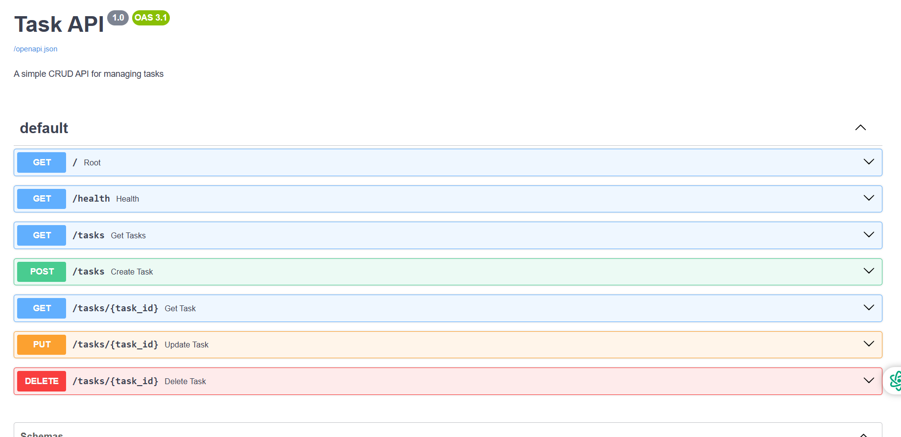

# Task API

A simple CRUD API built using FastAPI.

## Features

- Create Task
- Read All Tasks
- Read Task by ID
- Update Task
- Delete Task
- Swagger UI Documentation

## Installation

```bash
pip install fastapi uvicorn
```

## Run

```bash
uvicorn main:app --reload
```

Open:

- API: http://127.0.0.1:8000
- Swagger UI: http://127.0.0.1:8000/docs

## API Endpoints

| Method | Endpoint | Description |
|--------|----------|-------------|
| GET | / | Root |
| GET | /health | Health Check |
| GET | /tasks | Get All Tasks |
| GET | /tasks/{task_id} | Get Task by ID |
| POST | /tasks | Create Task |
| PUT | /tasks/{task_id} | Update Task |
| DELETE | /tasks/{task_id} | Delete Task |

## Example

```bash
curl -X GET http://127.0.0.1:8000/tasks
```

## Swagger Screenshot


